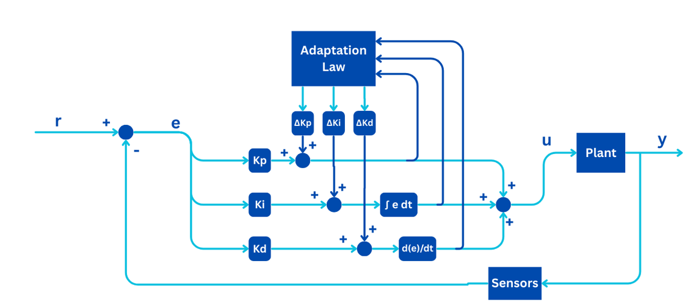

# STM32 Drone Flight Controller (WIP)  
A real-time, flight controller for STM32F4-based drones, built using FreeRTOS and custom drivers.

---

## Features  
- Modular FreeRTOS-based architecture (manual + autonomous modes)
- Angle Mode
- Madgwick sensor fusion for stable orientation  
- PID control for roll, pitch, yaw, and throttle  
- Altitude hold via barometer  
- Radio: nRF24L01 (override)
- Watchdog-protected system with failsafe reboot  (SENSOR GLITCH)
- Clean, low-latency motor PWM generation via timers  
- Custom lightweight libraries 

---

## Hardware  
- **STM32F411 Blackpill**  
- **MPU6050** (IMU)  
- **QMC5883P** (Magnetometer)  
- **BMP280** (Barometer)  
- GPS (optional)  
- **nRF24L01+ PA/LNA** modules  
- **Brushless motors + ESCs**  

---

## ⚙️ Getting Started  

> Requirements:  
> PlatformIO / VS Code, ST-Link, basic STM32 toolchain

Human input from the controller is Angle in Degrees. Then the flight code will convert it into radians for computations.

Adaptive P-PID per axis: 
P outer loop: angle error (50 Hz)
PID inner loop: angular rates error (250Hz)
1:5 ratio

# Control Input
- Roll and Pitch inputs are angle [-30,30] deg for safety.
- Yaw will be angular rate max cmd: [-360,360] deg/sec.
- Internal calculation uses radians.

# Control Scheme
- Cascaded adaptive P-PID architecture.
- Outer loop, P-controller, angle position, running on 50 Hz,
  and output (desired angular rate) is clamped by [-pi,pi].
- Inner loop, PID-controller, angular rate, running on 250 Hz,
  and output is directly clamped to pwm ticks for the mixer
  by their authority: [-150,150].
- Throttle is clamped: [0,1000]. 

# Communication data transforms
- From RX (int16_t: +- 300.00f): 
  Roll & Pitch, and Yaw rate cmd max limit: +- 30.00f, +- 180.00f;
  Scaled to 100 before sending to convert (float -> int16_t);
- TX:
  Scaled the Attitude command by 1/100: (int16_t -> float)
  
# ESC calibration:[1000,2000] us pwm ticks

# EMA (LPF): X = (1 - alpha) * X + alpha * X_prev
- command filter:             alpha = 0.8f
- altitude (BMP sensor):      alpha = 0.8f (inv config) 
- altitutude complementary:   alpha = 0.9f (inv)
- Madgwick, MPU6050, QMC:     No LPF

# Failsafes (TODO):
- WDT for sensor freeze (done)
- Kill switch flag to imovalise the motors
- Emergency Landing when the signal is disconnected 
  (gradually descent)

# Controller Block Diagram (one block, not cascaded or the full architecture):
