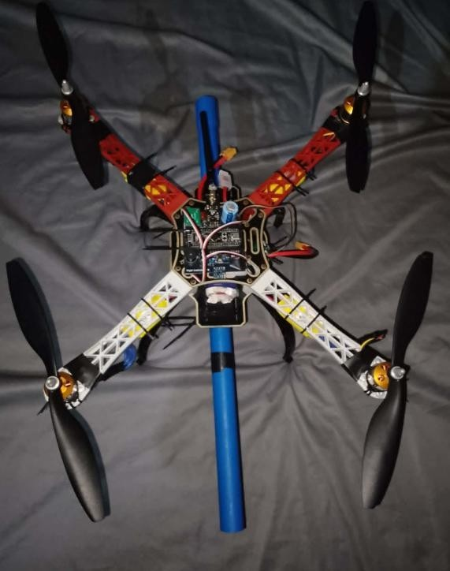
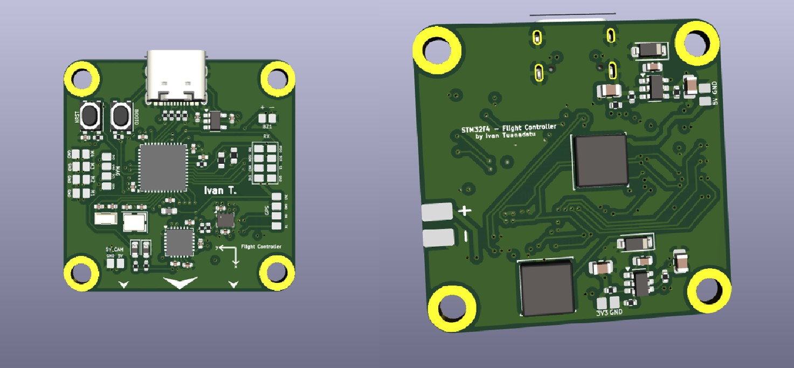
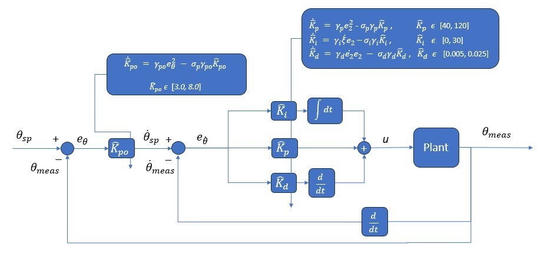

# STM32 Drone Flight Controller

**Status: Flight-Validated on 450mm Quadrotor**

A real-time flight controller for STM32F4-based drones, built using FreeRTOS and custom drivers.

**450mm Quadrotor**

**KiCAD Flight Controller**

**V2.0 - 4-Layer Design**

---

## Features  

- Modular FreeRTOS-based architecture
- ATTi (Attitude) Mode
- Madgwick Sensor Fusion (9DoF) for Attitude Estimation
- Vertical Velocity 3-State Kalman Filter Estimation 
- Vertical Velocity PI Controller  
- Radio: nRF24L01 
- Watchdog-protected system with failsafe reboot (SENSOR GLITCH)
- Clean, low-latency motor PWM generation via timers  
- Custom lightweight libraries 

---

## Hardware  

- **MCU:** STM32F411CEU
- **IMU:** MPU6050
- **Magnetometer:** QMC5883P (Optional)
- **Barometer:** BMP280
- **Radio:** nRF24L01+ PA/LNA
- **Motors:** 930KV Brushless
- **ESCs:** 30A
- **DC-DC Buck:** 1.2A @ 3.3V

---

## Control Architecture

### Control Input Limits

- **Roll:** [-20, 20] degrees
- **Pitch:** [-20, 20] degrees
- **Yaw rate:** [-360, 360] deg/sec
- **Vertical velocity:** [-0.8, 1.0] m/s

### Cascaded Adaptive P-PID (Roll & Pitch)

- **Outer loop (angle)**
  - Controller: P
  - Frequency: 100 Hz
  - Output limit: [-π, π] rad/s

- **Inner loop (rate)**
  - Controller: PID
  - Frequency: 500 Hz
  - Output limit: [-150, 150] PWM ticks

### Yaw PI Controller

- **Rate only**
  - Controller: PI
  - Frequency: 500 Hz
  - Output limit: [-100, 100] PWM ticks

### Vertical Velocity

- **Velocity loop**
  - Controller: PI
  - Frequency: 100 Hz
  - Output limit: [0, 750] PWM ticks

### ESC Calibration

- **PWM min:** 1000 µs
- **PWM max:** 2000 µs

### Low-Pass Filters

- **PT1:** EMA (Exponential Moving Average)
- **PT2:** Cascaded EMA

---

## Controller Block Diagrams

**Roll & Pitch Cascaded P-PID Controller**

**Yaw PI Controller**

---

## Timing Configuration

- **Sensor read:** 1 kHz
- **Attitude PID + Madgwick:** 500 Hz
- **Vertical Velocity PI:** 100 Hz
- **Radio:** Interrupt-driven
- **Watchdog:** 1 Hz

---

## Communication

- **Max payload:** 32 bytes per transmission
- **Direction:** Bidirectional (2-way)
- **Protocol:** nRF24L01

---

---

## Connect

- **Email:** ivantuanadatu204@gmail.com
- **LinkedIn:** [linkedin.com/in/ayob-ii-tuanadatu](www.linkedin.com/in/ayob-ii-tuanadatu)

---

## License
MIT